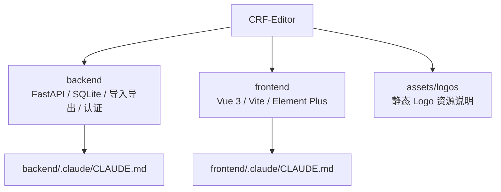

# CRF 编辑器 — 项目 AI 上下文

> 最近更新：2026年4月27日 星期一 05:45:45 PDT  
> 根级文档保持简明；实现细节优先进入模块级文档。

## 项目概览
- CRF（Case Report Form）编辑器用于临床研究表单的设计、维护、导入、预览与导出。
- 当前架构：FastAPI + SQLAlchemy + SQLite 后端，Vue 3 + Vite + Element Plus 前端。
- 后端可在前端构建产物存在时托管 `frontend/dist`；开发模式由 Vite 将 `/api` 代理到后端。
- 桌面发行入口位于 `backend/app_launcher.py`，用于本地启动后端、打开浏览器并保留系统托盘。
- 面向用户的项目文档见：`README.md`、`README.en.md`。
- 详细模块说明见：`backend/.claude/CLAUDE.md`、`frontend/.claude/CLAUDE.md`。

## 模块导航


## 模块索引
| 模块 | 路径 | 技术栈 | 职责 | 关键入口 | 测试 |
| --- | --- | --- | --- | --- | --- |
| backend | `backend/` | FastAPI、SQLAlchemy、SQLite、Pydantic、PyJWT、passlib、python-docx | API、认证、管理员、项目隔离、轻量迁移、导入导出、桌面发行入口 | `backend/main.py`、`backend/app_launcher.py` | `backend/tests/` |
| frontend | `frontend/` | Vue 3、Vite、Element Plus、sortablejs、vuedraggable | 登录、项目工作台、管理员工作台、表单设计器、导入导出、主题与预览交互 | `frontend/src/main.js`、`frontend/src/App.vue` | `frontend/tests/` |
| assets | `assets/logos/` | 静态资源 | Logo 示例资源说明；运行时上传不写入该目录 | `assets/logos/README.md` | 无 |

## 核心能力
- 项目、访视、表单、字段、单位、选项字典管理
- 用户认证、管理员用户管理、项目隔离、普通用户自助改密
- 模板库 `.db` 导入、项目 `.db` 导入 / 整库合并、Word `.docx` 导入对比
- 表单设计器实时预览、字段实例快编、CRF 模拟渲染
- 项目复制、项目 Logo 管理、Word 导出、数据库导出
- AI 配置测试、主题切换、桌面打包发行

## 关键入口
- 后端开发入口：`backend/main.py`
- 桌面发行入口：`backend/app_launcher.py`
- 后端配置：`backend/src/config.py`（读取项目根目录 `config.yaml`，生产优先使用 `CRF_*` 环境变量）
- 后端数据库：`backend/src/database.py`（SQLite PRAGMA、Session 与轻量迁移）
- 后端路由：`backend/src/routers/`
- 后端服务：`backend/src/services/`
- 前端入口：`frontend/src/main.js`
- 前端应用壳层：`frontend/src/App.vue`
- 前端开发配置：`frontend/vite.config.js`

## 常用命令
```bash
cd backend && python main.py
cd frontend && npm run dev
cd frontend && npm run build
cd frontend && npm run lint
cd frontend && npm run format
cd backend && python -m pytest
cd frontend && node --test tests/*.test.js
```

## 开发约定
- 后端分层：`routers -> repositories/services -> models/schemas`。
- 重逻辑放 `backend/src/services/`，接口层保持轻量。
- 数据结构演进集中在 `backend/src/database.py` 的轻量迁移逻辑。
- 前端复杂复用逻辑放 `frontend/src/composables/`。
- API 请求统一走 `frontend/src/composables/useApi.js`。
- 字段渲染统一复用 `frontend/src/composables/useCRFRenderer.js`。
- 字段展示属性与预览展示逻辑优先复用 `frontend/src/composables/formFieldPresentation.js`。
- 功能、命令或测试入口变更时，同步更新 `README.md`、`README.en.md`、模块级 `CLAUDE.md` 与 `.claude/index.json`。

## 安全与部署约束
- 生产部署优先使用根目录 `.env.example` 中的 `CRF_*` 环境变量。
- `CRF_ENV=production` 时 docs 关闭、必须提供 `CRF_AUTH_SECRET_KEY`、JWT TTL 不得超过 60 分钟。
- 登录、改密与高成本导入接口在 production 启用单机内存限流；当前实现不适用于多实例部署。
- 项目 Logo 仅允许位图格式，历史 SVG/XML Logo 读取会被拒绝。
- `template_path` 必须位于白名单目录内且为 `.db`。
- production 空库首次启动会自动创建或修复保留管理员账号；上线后需立即完成管理员账号审计与访问面检查。

## 跨栈契约
- 列宽规划：后端 `backend/src/services/width_planning.py` 与前端 `frontend/src/composables/useCRFRenderer.js` 必须同步演进。
- 列宽 fixture：`backend/tests/fixtures/planner_cases.json` 同时被后端 `backend/tests/test_width_planning.py` 与前端 `frontend/tests/columnWidthPlanning.test.js` 使用。
- 排序契约：后端 `backend/src/services/order_service.py` 与前端 `frontend/src/composables/useOrderableList.js` / `useSortableTable.js` 需要保持接口语义一致。
- 认证契约：后端 `backend/src/routers/auth.py`、`backend/src/services/auth_service.py` 与前端 `frontend/src/App.vue`、`frontend/src/components/LoginView.vue`、`frontend/src/components/AdminView.vue` 需要同步检查。

## 测试策略
- 后端测试使用 `pytest`，包含认证、权限、导入导出、排序、列宽规划、WAL、安全响应头、项目隔离等用例。
- 前端测试使用 `node:test`，并引入 `fast-check` 做属性/契约校验；覆盖应用壳层、管理员结构、主题、侧边栏、设计器列宽、字段展示与导出状态。
- 本轮扫描未发现浏览器级 E2E 套件；当前回归以 API 与源码级测试为主。

## AI 使用指引
- 先看本文件确认模块边界，再进入对应模块 `CLAUDE.md` 深读。
- 涉及认证、JWT、管理员权限、限流或普通用户改密时，至少同步检查：`backend/src/routers/auth.py`、`backend/src/routers/admin.py`、`backend/src/services/auth_service.py`、`backend/src/services/user_admin_service.py`、`backend/src/rate_limit.py`、`frontend/src/App.vue`、`frontend/src/components/AdminView.vue`。
- 涉及导入导出或 Word 预览时，至少同步检查：`backend/src/routers/import_docx.py`、`backend/src/routers/projects.py`、`backend/src/services/import_service.py`、`backend/src/services/project_import_service.py`、`backend/src/services/export_service.py`、`frontend/src/components/TemplatePreviewDialog.vue`、`frontend/src/components/DocxCompareDialog.vue`、`frontend/src/components/SimulatedCRFForm.vue`。
- 涉及列宽 / 预览改动时，必须同步检查并更新：`backend/src/services/width_planning.py`、`frontend/src/composables/useCRFRenderer.js`、`backend/tests/test_width_planning.py`、`frontend/tests/columnWidthPlanning.test.js`。
- 涉及项目隔离或权限边界时，优先检查 `backend/src/dependencies.py`、`backend/tests/test_isolation.py`、`backend/tests/test_subresource_isolation.py`、`backend/tests/test_permission_guards.py`。

## 变更记录
- `2026年4月27日 星期一 05:45:45 PDT`：刷新文件统计数据，同步 backend tests 25→34、frontend composables 9→11、frontend tests 17→21。
