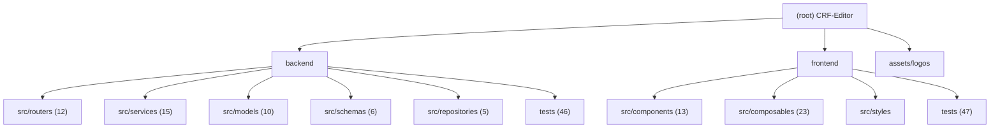

# CRF Editor -- Project AI Context

> Last updated: 2026-07-13
> Keep the root-level document concise; implementation details should go into module-level documents first.

## Project Overview
- The CRF (Case Report Form) editor is used for designing, maintaining, importing, previewing, and exporting clinical research forms.
- Current architecture: FastAPI + SQLAlchemy + SQLite backend, Vue 3 + Vite + Element Plus frontend.
- The backend can host `frontend/dist` when the frontend build artifacts exist; in development mode Vite proxies `/api` to the backend.
- The desktop release entry point is at `backend/app_launcher.py`, used to start the backend locally, open the browser, and keep a system tray.
- User-facing project documentation: `README.md`, `README.en.md`.
- Detailed module descriptions: `backend/.claude/CLAUDE.md`, `frontend/.claude/CLAUDE.md`.

## Module Navigation


## Module Index
| Module | Path | Tech Stack | Responsibilities | Key Entry Points | Tests |
| --- | --- | --- | --- | --- | --- |
| backend | `backend/` | FastAPI, SQLAlchemy, SQLite, Pydantic, PyJWT, passlib, python-docx | API, authentication, admin, project isolation, lightweight migrations, import/export, desktop release entry point, preview/export strict parity comparison, Word table-of-contents page number pre-calculation | `backend/main.py`, `backend/app_launcher.py` | `backend/tests/` (47 files) |
| frontend | `frontend/` | Vue 3, Vite, Element Plus, sortablejs, vuedraggable | Login, session countdown, project workbench, admin workbench, brief/full editing modes, form designer, import/export, theme and preview interaction | `frontend/src/main.js`, `frontend/src/App.vue` | `frontend/tests/` (47 files, including 46 `.test.js`) |
| assets | `assets/logos/` | Static resources | Logo sample resource notes; runtime uploads are not written to this directory | `assets/logos/README.md` | None |

## Core Capabilities
- Management of projects, visits, forms, fields, units, and option dictionaries; the codelist-free single checkbox field (`复选`) has an optional field-definition `checkbox_label` and falls back to the default character `✔` when empty
- Drag ordering plus ordinal quick edit for ordered frontend lists such as dictionaries, options, units, fields, visits, visit-form relations, and designer form lists
- User authentication, admin user management, project isolation, self-service password change for regular users
- Brief / full editing modes; in full mode, advanced identifiers such as OID / variable names are maintained uniformly, and both the form designer preview and the visits form preview can switch between eCRF / aCRF annotation views
- Template library `.db` import, project `.db` import / full-database merge, Word `.docx` import comparison with screenshot evidence panel, and default-off AI review suggestions that can be accepted per suggestion / per form / globally before import
- Form designer real-time preview, field instance quick edit/copy with no-drift undo/redo, simulated CRF rendering, shared full-mode eCRF / aCRF preview switching, aCRF vertical annotation dragging/persistence, and column width / row height dragging
- Project copy, project Logo management, Word export, database export, preview/export strict table field parity validation
- AI configuration testing, exact-first fuzzy search, session countdown with click-to-renew, theme switching, desktop packaging and release

## Key Entry Points
- Backend development entry: `backend/main.py`
- Desktop release entry: `backend/app_launcher.py`
- Backend configuration: `backend/src/config.py` (reads `config.yaml` from the project root; production prefers `CRF_*` environment variables)
- Backend database: `backend/src/database.py` (SQLite PRAGMA, Session, and lightweight migrations)
- Backend routers: `backend/src/routers/`
- Backend services: `backend/src/services/`
- Backend preview/export comparison: `backend/src/services/word_table_parity.py`, `backend/scripts/compare_word_table_parity.py`
- Backend table-of-contents page number pre-calculation: `backend/src/services/toc_pagination.py` (optional LibreOffice + `pypdf`; failure keeps non-empty fallback page numbers and Word field correction)
- Frontend entry: `frontend/src/main.js`
- Frontend application shell: `frontend/src/App.vue` (login recovery, project workbench, admin routing, global refresh, brief/full editing modes, theme and settings)
- Frontend development configuration: `frontend/vite.config.js`

## Common Commands
```bash
cd backend && python main.py
cd frontend && npm run dev
cd frontend && npm run build
cd frontend && npm run lint
cd frontend && npm run format
cd backend && python -m pytest
cd frontend && node --test tests/*.test.js
```

## Development Conventions
- Backend layering: `routers -> repositories/services -> models/schemas`.
- Put heavy logic in `backend/src/services/`, keeping the interface layer lightweight.
- Data structure evolution is centralized in the lightweight migration logic of `backend/src/database.py`.
- Put complex reusable frontend logic in `frontend/src/composables/`.
- Frontend reuse constraints: APIs go uniformly through `useApi.js`; field rendering goes uniformly through `useCRFRenderer.js`; field display attributes and preview display logic go uniformly through `formFieldPresentation.js`; user-facing fuzzy search ordering goes uniformly through `searchRanking.js`; ordinal jump sorting goes uniformly through `useOrdinalQuickEdit.js` alongside `useSortableTable.js` / `useOrderableList.js`.
- When features, commands, or test entry points change, synchronously update `README.md`, `README.en.md`, the module-level `CLAUDE.md`, and `.claude/index.json`.

## Security and Deployment Constraints
- Production deployment prefers the `CRF_*` environment variables from the root `.env.example`.
- When `CRF_ENV=production`, docs are disabled, `CRF_AUTH_SECRET_KEY` must be provided, and JWT TTL must not exceed 60 minutes.
- The login, password-change, and high-cost import endpoints enable single-node in-memory rate limiting in production; the current implementation is not suitable for multi-instance deployments.
- Project Logos only allow bitmap formats; reading historical SVG/XML Logos will be rejected.
- `template_path` must be located within a whitelisted directory and be a `.db` file.
- On first startup with an empty database in production, the reserved admin account is automatically created or repaired; after going live, an admin account audit and access-surface review must be completed immediately.

## Cross-Stack Contracts
- Column width planning: the backend `backend/src/services/width_planning.py` and the frontend `frontend/src/composables/useCRFRenderer.js` must evolve in sync. Shared constants `WEIGHT_CHINESE=2`, `WEIGHT_ASCII=1`, `FILL_LINE_WEIGHT=6`, `UNDERSCORE_CHAR_CM=0.19`, `CELL_HPAD_CM=0.4`, `FILL_LINE_SAFETY_CM=0.2`, `FILL_LINE_MIN_CHARS=6`, `FILL_LINE_MAX_CHARS=80`, `FILL_LINE_EPSILON=1e-9`, `INLINE_HEADER_FLOOR=WEIGHT_CHINESE*4=8` (applies only to inline tables, protecting short headers of ≤4 characters from being squeezed by long neighbors to the point they cannot fit on a single line), `AVAILABLE_CM=14.66`. The adaptive underscore count is used directly for whole-cell text fill-lines; choice trailing underscores use the same width-derived count after subtracting the marker + label footprint so the atom stays within the column. Changing either side requires syncing the other and regenerating fixtures via `frontend/scripts/generatePlannerFixtures.mjs`.
- Column width fixtures: `backend/tests/fixtures/planner_cases.json` is output from the generator as a single source of truth, and is used simultaneously by the backend `backend/tests/test_width_planning.py` and the frontend `frontend/tests/columnWidthPlanning.test.js`.
- Checkbox field contract: `复选` is a single codelist-free checkbox with conceptual option OID `1`, which is never persisted or shown in the dictionary library. Its optional field-definition `checkbox_label` falls back to the default character `✔` (not the field label) when empty; normal rendering is `label | □checkbox text`. Keep `backend/src/models/field_definition.py`, `backend/src/database.py`, `backend/src/schemas/field.py`, `backend/src/services/field_rendering.py`, `backend/src/services/export_service.py`, `backend/src/services/import_service.py`, `backend/src/services/project_clone_service.py`, `backend/src/services/project_import_service.py`, `frontend/src/components/FieldsTab.vue`, `frontend/src/components/FormDesignerTab.vue`, and `frontend/src/composables/useCRFRenderer.js` aligned. It is not DOCX auto-detected and creates no aCRF option-level OID annotation.
- Ordering contract: the backend `backend/src/services/order_service.py` and the frontend `frontend/src/composables/useOrderableList.js` / `useSortableTable.js` need to keep consistent interface semantics.
- Authentication contract: the backend `backend/src/routers/auth.py`, `backend/src/services/auth_service.py` and the frontend `frontend/src/App.vue`, `frontend/src/components/LoginView.vue`, `frontend/src/components/AdminView.vue` need to be checked in sync.
- Form orientation contract: the backend `backend/src/models/form.py`, `backend/src/schemas/form.py`, `backend/src/database.py`, `backend/src/routers/forms.py`, `backend/src/services/project_clone_service.py`, `backend/src/services/project_import_service.py`, `backend/src/services/export_service.py` need to be synced with the frontend `frontend/src/components/FormDesignerTab.vue`; when `paper_orientation` changes, validate `test_form_paper_orientation.py`, `test_export_paper_orientation.py`, `test_project_copy.py` and the frontend source-level tests in sync.
- Word import screenshot evidence contract: the backend `backend/src/routers/import_docx.py`, `backend/src/services/docx_screenshot_service.py` and the frontend `frontend/src/components/DocxCompareDialog.vue`, `frontend/src/components/DocxScreenshotPanel.vue` need to keep consistent semantics for task status, page positioning, and failure prompts.
- Strict preview/export parity: the frontend `frontend/src/styles/main.css` `.wp-form-title` must keep `text-align: left`; `backend/src/services/word_table_parity.py` and `backend/scripts/compare_word_table_parity.py` are used to compare the form / row / cell text of the browser preview JSON and the exported `.docx`; see `.trellis/spec/guides/cross-stack-contracts.md` §5.
- aCRF annotation geometry and persistence: backend `backend/src/services/export_service.py`, `backend/src/schemas/form.py` (shared parse/serialize/canonicalize helpers), `backend/src/routers/forms.py` (create/update/copy), `backend/src/services/project_clone_service.py`, `backend/src/services/project_import_service.py`, `backend/src/services/import_service.py` (template import passthrough + mixed-column legacy read-only fallback), and frontend `frontend/src/composables/acrfAnnotationGeometry.js`, `frontend/src/composables/useAcrfAnnotationDrag.js`, `frontend/src/components/FormDesignerTab.vue`, `frontend/src/components/VisitsTab.vue` must evolve together; `Form.annotation_positions` string storage is canonicalized on every write path so copy/clone/project `.db` import/template import clamp + canonicalize instead of storing raw out-of-range values; see `.trellis/spec/guides/cross-stack-contracts.md` §6.

## Testing Strategy
- Backend tests use `pytest`, covering authentication, permissions, import/export, ordering, column width planning, WAL, security response headers, project isolation, batch-delete isolation, performance FK indexes, Docx screenshot failure semantics, Word table parity, and other cases.
- Frontend tests use `node:test` and introduce a self-developed lightweight property testing utility (`testProperty.js`) for property and contract validation; coverage includes the application shell, admin structure, theme, sidebar, designer column width/row height, field display, session countdown, Docx two-column preview, and export status.
- No browser-level E2E suite was found in this scan; the current regression suite is mainly based on API and source-level tests.

## AI Usage Guide
- When touching authentication, JWT, admin permissions, rate limiting, or regular-user password change, check at least these in sync: `backend/src/routers/auth.py`, `backend/src/routers/admin.py`, `backend/src/services/auth_service.py`, `backend/src/services/user_admin_service.py`, `backend/src/rate_limit.py`, `frontend/src/App.vue`, `frontend/src/components/AdminView.vue`.
- When touching import/export or Word preview, check at least these in sync: `backend/src/routers/import_docx.py`, `backend/src/routers/projects.py`, `backend/src/services/import_service.py`, `backend/src/services/project_import_service.py`, `backend/src/services/export_service.py`, `backend/src/services/word_table_parity.py`, `frontend/src/components/TemplatePreviewDialog.vue`, `frontend/src/components/DocxCompareDialog.vue`, `frontend/src/components/DocxScreenshotPanel.vue`, `frontend/src/components/SimulatedCRFForm.vue`.
- When touching column width / preview changes, you must check and update these in sync: `backend/src/services/width_planning.py`, `frontend/src/composables/useCRFRenderer.js`, `backend/tests/test_width_planning.py`, `frontend/tests/columnWidthPlanning.test.js`.
- When touching project isolation or permission boundaries, check first: `backend/src/dependencies.py`, `backend/tests/test_isolation.py`, `backend/tests/test_subresource_isolation.py`, `backend/tests/test_permission_guards.py`.

## .context Project Context

> The project uses `.context/` to manage development decision context.

- Coding standards: `.context/prefs/coding-style.md`
- Workflow rules: `.context/prefs/workflow.md`
- Decision history: `.context/history/commits.md`

**Rule**: Always read prefs/ before modifying code, and log decisions according to the rules in workflow.md when making decisions.

## Git Workflow
- **draft → main must be merged via PR**; directly running `git push origin main` is forbidden.
- Process: complete development on draft → create a PR (draft → main) → review/merge the PR → auto-sync to main.
- The `draft` branch can be pushed directly to remote; the `main` branch only accepts PR merges.

## Change Log
- `2026-07-14` (task `07-14-checkbox-default-check`): Checkbox (`复选`) empty-text fallback changed from the field label to the fixed default character `✔`. Single central fallback point per stack — backend `field_rendering.resolve_checkbox_label` (`CHECKBOX_DEFAULT_TEXT`, reused by export + width) and frontend `useCRFRenderer.resolveCheckboxText` (`CHECKBOX_DEFAULT_TEXT`, reused by render + width); export/parity inherit automatically. The designer / field-library "复选文本" input placeholder switched from the field label to a static `✔`. No data migration (empty stays empty, resolves to `✔` at runtime). `planner_cases.json` regenerated (fraction unchanged — single-field row min-width protection dominates). Updated backend `test_width_planning.py` / `test_export_service.py` and frontend `checkboxFieldType.test.js`; backend 695 passed/4 xfailed, frontend 490 passed, lint 0 errors.
- `2026-07-14` (task `07-14-crf-editor-batch-fixes`): Batch of four independent fixes. (1) Draggable column minimum widened (`useColumnResize.js` `MIN_RATIO` 0.1→0.02, `MAX_RATIO`→`1 - MIN_RATIO`; content-driven planner floors & `planner_cases.json` unchanged). (2) OID charset validation `^[A-Za-z0-9._-]+$` enforced at edit time only (no migration): backend `schemas/_common.py` validators wired into form/field/codelist Create/Update schemas ↔ frontend `composables/oidValidation.js` submit-path guards in `FormDesignerTab`/`FieldsTab`/`CodelistsTab`; optional codes may stay empty, required `variable_name` must be non-empty. (3) aCRF preview geometry parity: VisitsTab preview and designer preview now share a fixed A4 page (`.word-page--a4` / `.designer-scaled-word-page`), and the annotation default vertical offset moved `-120000`→`-26940 EMU` (centers the 0.7cm box on the cell text line) in `acrfAnnotationGeometry.js` + `export_service.py` in sync — see Cross-Stack Contracts (aCRF geometry); no `annotation_positions` migration. (4) Field library auto-refreshes after a designer property save (`FormDesignerTab.saveFieldProp` bumps `refreshKey` on the field-definition branch). Backend 695 passed/4 xfailed; frontend 476 passed (added `test_oid_validation.py`, `oidValidationWiring.test.js`).
- `2026-07-13` (task `07-13-designer-field-copy`): The form designer now copies persisted field instances directly below their source. Regular fields copy the complete definition through the existing backend endpoint and create a full instance duplicate; log rows duplicate only the instance. A draft guard, row-level double-click lock, orphan-definition cleanup, selection refresh, and robust undo/redo are included. Redo recreates/reuses the original copied-definition snapshot (including `checkbox_label`) rather than invoking copy again, preventing `_copyN` OID drift. Added frontend regression coverage; the frontend test inventory is now 47 files (46 `.test.js` + `testProperty.js`).
- `2026-07-12` (task `07-12-checkbox-field-type`): Added the codelist-free single checkbox field type (`复选`) across the backend, field library, form designer, previews, and Word export. `checkbox_label` is optional at field-definition level and falls back to the field label; normal layout renders `label | □checkbox text`. Project copy, project `.db` import, and template import preserve the type, label, and null `codelist_id`; shared width planning and preview/export parity include the checkbox text. DOCX import does not infer the type, and aCRF adds no option-level OID annotation. Documentation inventory now reflects the current 47 backend and 46 frontend test files.
- `2026-07-05` (task `07-05-docx-ai-suggestion-accept`): Word 导入预览 now supports default-off AI suggestion acceptance at three levels (per suggestion / per form / all forms), with the right-side `SimulatedCRFForm` preview rendering only the accepted suggestion subset in real time and the execute payload appending `ai_overrides` only when non-empty. The backend AI suggestion index contract is now aligned to the log_row-filtered real field order in both `ai_review_service.py` and `docx_import_service.py`, preventing preview/import mismatches when log rows exist. Documentation sync also refreshes the root/backend module counts and index entries for the current backend service/test inventory.
- `2026-07-04`: Word 导入截图证据页码匹配修复。`backend/src/services/docx_screenshot_service.py` now uses PDF-outline-first form page detection (`doc.get_toc()`) with text fallback instead of relying solely on first non-TOC text hits, and the TOC/index-page heuristic now uses matched-form density/ratio plus substring dedup so compact index pages in `image/标准eCRF.docx` no longer collapse early forms onto pages 4-6. Reopening the screenshot panel also stops recomputing page ranges when the sorted form-name signature is unchanged (`ScreenshotTask.detect_signature`). Added backend regressions for compact-index detection, non-TOC content protection, substring collisions, outline mapping, signature-based cache reuse, plus a LibreOffice-gated real-document assertion; backend suite verified at `583 passed, 4 xfailed`.
- `2026-06-30`: `annotation_positions` persistence contract gap closed. `schemas/form.py::preserve_annotation_positions_storage` string branch now goes through `serialize_annotation_positions` so copy/clone/project `.db` import/template import canonicalize (clamp + key-sort) on write instead of storing raw out-of-range values. `import_service.py` template import now passes through `annotation_positions` via `preserve_annotation_positions_storage` with mixed-column legacy read-only compatibility (column probe + raw SQL single-column fallback for both `_load_template_forms` and `get_template_form_paper_orientation`, mirroring `paper_orientation`). `routers/import_template.py` converts service `ValueError` into 400 JSON. `VisitsTab.vue::mergeFormIntoState` now merges each collection (`allForms`/`visitForms`/`matrixData.forms`/`formPreviewForm`) on its own item base so aCRF drag-save no longer drops `visitForms.sequence`. Added backend regressions (out-of-range canonicalization on copy/clone/project-import, template import preservation/rejection/legacy-fallback, mixed-column preview tolerance, route-level fail-closed JSON) and a frontend contract test for per-collection base-merge; `test_form_annotation_positions.py` helper fixed to seed ORM `Form` directly (was misusing router `FormResponse`, masking 3 red tests).
- `2026-06-30`: VisitsTab Word preview now shares the persisted `crf_view_mode` with `FormDesignerTab.vue`, renders the same red aCRF field/domain annotations in the preview dialog, and reuses `frontend/src/composables/acrfAnnotationGeometry.js` + `frontend/src/composables/useAcrfAnnotationDrag.js` for vertical drag persistence to `Form.annotation_positions`. Documentation sync also catches frontend composables 19→21 and the frontend test directory at 41 files (40 `.test.js` + `testProperty.js`).
- `2026-06-29`: FormDesignerTab preview now adds a complete-mode-only eCRF / aCRF toggle in both the canvas header and fullscreen designer header, sharing one persisted `crf_view_mode`. The same PR family also adds `frontend/src/composables/acrfAnnotationGeometry.js` and `frontend/src/composables/useAcrfAnnotationDrag.js` so designer-side aCRF overlays can be rendered with shared red annotation geometry and persisted vertical dragging, and the frontend test directory grows to 41 files (40 `.test.js` + `testProperty.js`) with `acrfAnnotationGeometry.test.js`, `acrfAnnotationPersistence.test.js`, and `acrfViewToggle.test.js`.
- `2026-06-25`: VisitsTab right-side visit-form list now uses the same bordered `el-table` + `useSortableTable` mechanism as the left visit list, replacing the handwritten `vuedraggable` block while keeping visit-form ordinal quick edit, preview, remove actions, and drag reinitialization after visit switches / list reloads. Frontend styles dropped the orphaned handwritten visit-form header classes, and the source-level ordering / header wiring tests were updated accordingly.
- `2026-06-24`: Ordered-list ordinal quick edit. Added shared frontend composable `frontend/src/composables/useOrdinalQuickEdit.js` and wired double-click ordinal input for codelists, codelist options, units, fields, visits, visit-form relations, and the left-side form list in `FormDesignerTab.vue`, all reusing existing reorder endpoints with filter-disabled semantics and restore-on-failure behavior. Frontend composables 16→19, frontend test directory 33→38 (37 `.test.js` + `testProperty.js`; added `useOrdinalQuickEdit.test.js` and `ordinalQuickEditWiring.test.js`, plus expanded ordering structure coverage).
- `2026-06-23`: Field library inline codelist editing. `frontend/src/components/FieldsTab.vue` adds 新增字典 / 编辑字典 inline entries on the choice-field option row (parity with the form designer), reusing existing codelist `create` / `snapshot` / `references` endpoints with impact confirmation, cache invalidation, and global `refreshKey` sync; implemented standalone in FieldsTab without touching `FormDesignerTab.vue` (backend unchanged). Frontend test directory 32→33 (32 `.test.js` + `testProperty.js`; added `fieldsTabCodelistQuickEdit.test.js`).
- `2026-06-23`: Frontend search ranking refresh. Frontend composables 15→16 (added `searchRanking.js` for exact-first fuzzy search ranking), frontend test directory 30→32 (31 `.test.js` + `testProperty.js`; added helper and wiring regressions for ranked fuzzy search). Synced README feature text, frontend module context, and code-spec guidance for reusable search ordering.
