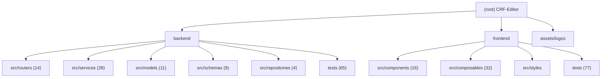

# CRF Editor -- Project AI Context

> Last updated: 2026-10-09
> Keep the root-level document concise; implementation details should go into module-level documents first.

## Project Overview
- The CRF (Case Report Form) editor is used for designing, maintaining, importing, previewing, and exporting clinical research forms.
- Current architecture: FastAPI + SQLAlchemy + SQLite backend, Vue 3 + Vite + Element Plus frontend.
- The backend can host `frontend/dist` when the frontend build artifacts exist; in development mode Vite proxies `/api` to the backend.
- The desktop release entry point is at `backend/app_launcher.py`, used to start the backend locally, open the browser, and keep a system tray.
- User-facing project documentation: `README.md`, `README.en.md`.
- Detailed module descriptions: `backend/.claude/CLAUDE.md`, `frontend/.claude/CLAUDE.md`.

## Module Navigation

```mermaid
graph TD
    A["(root) CRF-Editor"] --> B["backend"];
    B --> B1["src/routers (14)"];
    B --> B2["src/services (28)"];
    B --> B3["src/models (11)"];
    B --> B4["src/schemas (9)"];
    B --> B5["src/repositories (4)"];
    B --> B6["tests (65)"];
    A --> C["frontend"];
    C --> C1["src/components (16)"];
    C --> C2["src/composables (32)"];
    C --> C3["src/styles"];
    C --> C4["tests (77)"];
    A --> D["assets/logos"];

    click B "./backend/.claude/CLAUDE.md" "View backend module docs"
    click C "./frontend/.claude/CLAUDE.md" "View frontend module docs"
```

## Module Index
| Module | Path | Tech Stack | Responsibilities | Key Entry Points | Tests |
| --- | --- | --- | --- | --- | --- |
| backend | `backend/` | FastAPI, SQLAlchemy, SQLite, Pydantic, PyJWT, passlib, python-docx | API, authentication, admin, project isolation, lightweight migrations, import/export, read-only template field search, reference-aware delete guards, desktop release entry point, preview/export strict parity comparison, Word table-of-contents page number pre-calculation, recycle-bin auto-cleanup background task | `backend/main.py`, `backend/app_launcher.py` | `backend/tests/` (65 files, including 63 `test_*.py`) |
| frontend | `frontend/` | Vue 3, Vite, Element Plus, sortablejs, vuedraggable | Login, session countdown, project workbench, admin workbench, brief/full editing modes, form designer, import/export, template field search dialog, reference-aware delete gating, theme and preview interaction | `frontend/src/main.js`, `frontend/src/App.vue` | `frontend/tests/` (77 files: 70 node:test `.test.js` + `testProperty.js` + 6 vitest mount-test files under `tests/component/` — 4 `.spec.js` + `setup.js` + `vueWarnGate.js`) |
| assets | `assets/logos/` | Static resources | Logo sample resource notes; runtime uploads are not written to this directory | `assets/logos/README.md` | None |
| deploy | `deploy/` | Shell, systemd | Linux 生产部署：systemd 服务安装/卸载脚本、unit 模板、环境变量样例、Nginx 反代示例 | `deploy/install-service.sh`, `deploy/crf-editor.service.template` | None |

## Core Capabilities
- Management of projects, visits, forms, fields, units, and option dictionaries; the codelist-free single checkbox field (`复选`) has an optional field-definition `checkbox_label` and falls back to the default character `✔` when empty
- Drag ordering plus ordinal quick edit for ordered frontend lists such as dictionaries, options, units, fields, visits, visit-form relations, and designer form lists
- User authentication, admin user management, project isolation, self-service password change for regular users
- Admin recycle bin with estimated-size display, configurable age/size auto-cleanup policy, preview-before-save dry-run, and an in-process background cleanup loop
- Admin workspace with top-level 用户管理 / 机构管理 dual entries; org presets are maintained in-page (persistent list + right editor, stacked on narrow screens) with immediate Logo thumbnails and built-in click-to-zoom preview
- Brief / full editing modes; in full mode, advanced identifiers such as OID / variable names are maintained uniformly, and both the form designer preview and the visits form preview can switch between eCRF / aCRF annotation views
- Template library `.db` import, project `.db` import / full-database merge, Word `.docx` import comparison with screenshot evidence panel, and default-off AI review suggestions that can be accepted per suggestion / per form / globally before import
- Read-only 模板字段查询 (template field search) dialog in complete edit mode: a non-modal draggable window cross-references template-library fields by OID / label / source-form OID (`GET /api/template-fields`, excludes 标签 fields / log rows / soft-deleted projects; four-group ranking field-strong > form-OID-strong > field-fuzzy > form-OID-fuzzy over the shared fuzzy rules; inline read-only multi-line source cells `form OID + form name` with 仅字段库 fallback, never copy targets; click-cell-to-copy elsewhere)
- Reference-aware deletion for dictionaries, units, field definitions, and forms: block single deletes when referenced; batch deletes show blocked references and confirm only unreferenced items in one dialog. Dictionary/unit preflight includes unplaced field-library definitions without changing edit-impact queries.
- Form designer real-time preview, full-screen form-switch dropdown and inline form-property editing (OID / name / paper orientation), field instance quick edit and regular-field copy-as-draft with save-gated persistence (log-row copy remains immediate), no-drift undo/redo, simulated CRF rendering, shared full-mode eCRF / aCRF preview switching, aCRF vertical annotation dragging/persistence, and column width / row height dragging
- Project copy, project Logo management, Word export, database export, preview/export strict table field parity validation
- AI configuration testing, tiered fuzzy search (exact / substring / subsequence / bounded typo tolerance), Element Plus zh-cn locale, iconized list actions with tooltips, centered table selection checkboxes, session countdown with click-to-renew, theme switching, desktop packaging and release

## Key Entry Points
- Backend development entry: `backend/main.py` (production 模式下自动关闭 uvicorn 热重载)
- Desktop release entry: `backend/app_launcher.py`
- Production deployment: `deploy/install-service.sh` (systemd 服务安装/卸载), `deploy/crf-editor.service.template`, `deploy/crf-editor.env.example`, `deploy/nginx/crf-editor.conf.example`; 使用说明见 README「生产部署（Linux / systemd）」章节
- Backend configuration: `backend/src/config.py` (reads `config.yaml` from the project root; production prefers `CRF_*` environment variables)
- Backend database: `backend/src/database.py` (SQLite PRAGMA, Session, and lightweight migrations)
- Backend routers: `backend/src/routers/`
- Backend services: `backend/src/services/`
- Backend preview/export comparison: `backend/src/services/word_table_parity.py`, `backend/scripts/compare_word_table_parity.py`
- Backend table-of-contents page number pre-calculation: `backend/src/services/toc_pagination.py` (optional LibreOffice + `pypdf`; failure keeps non-empty fallback page numbers and Word field correction)
- Frontend entry: `frontend/src/main.js`
- Frontend application shell: `frontend/src/App.vue` (login recovery, project workbench, admin routing, global refresh, brief/full editing modes, theme and settings)
- Frontend development configuration: `frontend/vite.config.js`

## Common Commands
```bash
cd backend && python main.py
cd frontend && npm run dev
cd frontend && npm run build
cd frontend && npm run lint
cd frontend && npm run format
cd backend && python -m pytest
cd backend && python -m pytest --cov=src --cov=main --cov-report=term-missing:skip-covered   # 覆盖率统计（不设门槛）
cd backend && python -m ruff format .          # format all backend Python files (version in requirements-dev.txt, config in backend/ruff.toml)
cd backend && python -m ruff format --check .  # check: exit 1 = reformat needed; other non-zero = runtime/config error
cd frontend && npm test                    # node --test tests/*.test.js && vitest run
cd frontend && npm run test:component      # 仅运行 vitest 组件挂载测试
cd frontend && node --test tests/*.test.js
git config core.hooksPath .githooks  # 一次性启用本机 pre-commit 门禁（所有 worktree 共享）
sudo bash deploy/install-service.sh          # 安装 systemd 生产服务（后台运行 + 开机自启）
sudo bash deploy/install-service.sh uninstall
```

## Development Conventions
- Backend layering: `routers -> repositories/services -> models/schemas`.
- Put heavy logic in `backend/src/services/`, keeping the interface layer lightweight.
- Data structure evolution is centralized in the lightweight migration logic of `backend/src/database.py`.
- Put complex reusable frontend logic in `frontend/src/composables/`.
- Frontend reuse constraints: APIs go uniformly through `useApi.js`; field rendering goes uniformly through `useCRFRenderer.js`; field display attributes and preview display logic go uniformly through `formFieldPresentation.js`; user-facing fuzzy search ordering goes uniformly through `searchRanking.js`; ordinal jump sorting goes uniformly through `useOrdinalQuickEdit.js` alongside `useSortableTable.js` / `useOrderableList.js`.
- When features, commands, or test entry points change, synchronously update `README.md`, `README.en.md`, the module-level `CLAUDE.md`, and `.claude/index.json`.

- Keep `## Change Log` in this file as a one-line index only; full task narratives go to `.context/history/archives/claudemd-changelog.md`. This file must stay under the 40k-char context limit.

## Security and Deployment Constraints
- Production deployment prefers the `CRF_*` environment variables from the root `.env.example`.
- When `CRF_ENV=production`, docs are disabled, `CRF_AUTH_SECRET_KEY` must be provided, and JWT TTL must not exceed 60 minutes.
- The login, password-change, and high-cost import endpoints enable single-node in-memory rate limiting in production; the current implementation is not suitable for multi-instance deployments.
- Project Logos only allow bitmap formats; reading historical SVG/XML Logos will be rejected.
- `template_path` must be located within a whitelisted directory and be a `.db` file.
- On first startup with an empty database in production, the reserved admin account is automatically created or repaired; after going live, an admin account audit and access-surface review must be completed immediately.

## Cross-Stack Contracts
- Column width planning: the backend `backend/src/services/width_planning.py` and the frontend `frontend/src/composables/useCRFRenderer.js` must evolve in sync. Shared constants `WEIGHT_CHINESE=2`, `WEIGHT_ASCII=1`, `FILL_LINE_WEIGHT=6`, `UNDERSCORE_CHAR_CM=0.19`, `CELL_HPAD_CM=0.4`, `FILL_LINE_SAFETY_CM=0.2`, `FILL_LINE_MIN_CHARS=6`, `FILL_LINE_MAX_CHARS=20`, `FILL_LINE_EPSILON=1e-9`, `INLINE_HEADER_FLOOR=WEIGHT_CHINESE*4=8` (applies only to inline tables, protecting short headers of ≤4 characters from being squeezed by long neighbors to the point they cannot fit on a single line), `AVAILABLE_CM=14.66`. The adaptive underscore count is used directly for whole-cell text fill-lines (capped at 20 since 2026-09-30; the preview's auto-generated fill-line span also carries an HTML-only `max-width:10.0em` from `renderCtrlHtml`, user-authored underscores excluded). Changing either side requires syncing the other and regenerating fixtures via `frontend/scripts/generatePlannerFixtures.mjs`.
- Column width fixtures: `backend/tests/fixtures/planner_cases.json` is output from the generator as a single source of truth, and is used simultaneously by the backend `backend/tests/test_width_planning.py` and the frontend `frontend/tests/columnWidthPlanning.test.js`.
- Checkbox field contract: `复选` is a single codelist-free checkbox with conceptual option OID `1`, which is never persisted or shown in the dictionary library. Its optional field-definition `checkbox_label` falls back to the default character `✔` (not the field label) when empty; normal rendering is `label | □checkbox text`. Keep `backend/src/models/field_definition.py`, `backend/src/database.py`, `backend/src/schemas/field.py`, `backend/src/services/field_rendering.py`, `backend/src/services/export_service.py`, `backend/src/services/import_service.py`, `backend/src/services/project_clone_service.py`, `backend/src/services/project_import_service.py`, `frontend/src/components/FieldsTab.vue`, `frontend/src/components/FormDesignerTab.vue`, and `frontend/src/composables/useCRFRenderer.js` aligned. It is not DOCX auto-detected and creates no aCRF option-level OID annotation.
- Ordering contract: the backend `backend/src/services/order_service.py` and the frontend `frontend/src/composables/useOrderableList.js` / `useSortableTable.js` need to keep consistent interface semantics.
- Authentication contract: the backend `backend/src/routers/auth.py`, `backend/src/services/auth_service.py` and the frontend `frontend/src/App.vue`, `frontend/src/components/LoginView.vue`, `frontend/src/components/AdminView.vue`, `frontend/src/composables/useApi.js` need to be checked in sync; the `useApi.js` write-back of `X-Refreshed-Token` and its 401 sign-out are session-scoped — only a response whose request carried the still-current `crf_token` may write the token or dispatch `crf:auth-expired` (see `.trellis/spec/guides/cross-stack-contracts.md` §3 rules 4–5).
- Form orientation contract: the backend `backend/src/models/form.py`, `backend/src/schemas/form.py`, `backend/src/database.py`, `backend/src/routers/forms.py`, `backend/src/services/project_clone_service.py`, `backend/src/services/project_import_service.py`, `backend/src/services/export_service.py` need to be synced with the frontend `frontend/src/components/FormDesignerTab.vue`; when `paper_orientation` changes, validate `test_form_paper_orientation.py`, `test_export_paper_orientation.py`, `test_project_copy.py` and the frontend source-level tests in sync.
- Word import screenshot evidence contract: the backend `backend/src/routers/import_docx.py`, `backend/src/services/docx_screenshot_service.py` and the frontend `frontend/src/components/DocxCompareDialog.vue`, `frontend/src/components/DocxScreenshotPanel.vue` need to keep consistent semantics for task status, page positioning, and failure prompts.
- Strict preview/export parity: the frontend `frontend/src/styles/main.css` `.wp-form-title` must keep `text-align: left`; `backend/src/services/word_table_parity.py` and `backend/scripts/compare_word_table_parity.py` are used to compare the form / row / cell text of the browser preview JSON and the exported `.docx`; see `.trellis/spec/guides/cross-stack-contracts.md` §5.
- aCRF annotation geometry and persistence: backend `backend/src/services/export_service.py`, `backend/src/schemas/form.py` (shared parse/serialize/canonicalize helpers), `backend/src/routers/forms.py` (create/update/copy), `backend/src/services/project_clone_service.py`, `backend/src/services/project_import_service.py`, `backend/src/services/import_service.py` (template import passthrough + mixed-column legacy read-only fallback), and frontend `frontend/src/composables/acrfAnnotationGeometry.js`, `frontend/src/composables/useAcrfAnnotationDrag.js`, `frontend/src/components/FormDesignerTab.vue`, `frontend/src/components/VisitsTab.vue` must evolve together; `Form.annotation_positions` string storage is canonicalized on every write path so copy/clone/project `.db` import/template import clamp + canonicalize instead of storing raw out-of-range values; see `.trellis/spec/guides/cross-stack-contracts.md` §6.
- API base path (subpath deployment): the frontend `frontend/vite.config.js` reads `VITE_BASE_PATH` (default `/`) into `base`; when non-root, all assets and API calls carry the prefix (`/crf/assets/...`, `/crf/api/...`). The runtime prefix is applied only at the `useApi.js` fetch boundary via the exported `apiUrl()` (cache keys / `invalidateCache` stay on raw paths), and the 8 bypass sites (`App.vue` export/import/_blobDownload/el-upload action, `LoginView.vue`, `ProjectInfoTab.vue` logo, `DocxScreenshotPanel.vue` pageUrl) must keep using `apiUrl()`. The backend stays zero-aware: nginx must strip the prefix (`location /crf/ { proxy_pass http://127.0.0.1:8888/; }`, trailing slash required). Desktop packaging requires a default (root) build; subpath builds are opt-in. Guarded by `frontend/tests/basePathDeployment.test.js`.
- Recycle-bin cleanup contract: backend `backend/src/config.py`, `backend/src/routers/admin.py`, `backend/src/services/project_size_service.py`, `backend/src/services/recycle_bin_cleanup_service.py`, `backend/src/background_jobs.py` and frontend `frontend/src/components/AdminView.vue`, `frontend/src/composables/byteSize.js` must evolve together. Shared canonical unit values are `day/month/year` and `MB/GB`; `month=30` days, `year=365` days. Response field `estimated_size_bytes` is an estimate, not the real SQLite-file delta, and the frontend must keep the estimate labeling/help text. See `.trellis/spec/guides/cross-stack-contracts.md` §11.
- Date/time format options: `frontend/src/composables/dateFormatOptions.js` is the single option-list source for `FieldsTab.vue` / `FormDesignerTab.vue`; backend `database.py` `_DATE_FORMAT_CANONICALS` mirrors it (contract test parses the JS file), `field_rendering.py` `render_date_time_placeholder` and `useCRFRenderer.js` `renderCtrl` must produce identical placeholder text for every format (hour-only 日期时间 `yyyy-MM-dd HH` / 时间 `HH` / `hh AP` included), and `docx_import_service.py` `_detect_field_type` recognizes the exported hour-only placeholders strictly. 12-hour `  AP` is preview-only (accepted gap); see `.trellis/spec/guides/cross-stack-contracts.md` §13.
- Template field search contract: backend `backend/src/routers/template_fields.py` + `backend/src/services/template_field_index_service.py` and frontend `frontend/src/composables/templateFieldSearch.js` + `frontend/src/components/TemplateFieldSearchDialog.vue` must evolve together (entry shape incl. `sources[].form_code: string | null` with read-only `form.code` probing, exclusion/merge rules, field/form-OID four-group search ranking, inline source display, click-to-copy semantics). See `.trellis/spec/guides/cross-stack-contracts.md` §12.
- Reference-delete contract: backend `field_definition_reference_service.py`, `codelists.py`, and `units.py` must keep reference queries aligned with DELETE/batch-delete guards; the opt-in `include_unplaced=true` adds library-only fields for delete preflight while default edit-impact responses remain unchanged. Frontend `referenceDeleteGuard.js` drives the eight single/batch deletion handlers, and codelist/option routes enforce project ownership before resource lookup. The four batch-delete 409 reference pre-checks run only over ids owned by the path project (foreign/nonexistent ids are silently ignored, never 409). See cross-stack-contracts §14 and `backend/auth-security.md`.

## Testing Strategy
- Backend tests use `pytest`, covering authentication, permissions, import/export, ordering, column width planning, WAL, security response headers, project isolation, batch-delete isolation, performance FK indexes, Docx screenshot failure semantics, Word table parity, and other cases.
- The backend suite is hermetic: `backend/tests/conftest.py` redirects the database / upload / screenshot / Word-import temp paths to a per-session temp root before `import main`, and equally isolates config sources (`CONFIG_FILE` → a nonexistent file under the temp root; `_ENV_OVERRIDE_MAP` variables other than the three forced keys are scrubbed; the auth secret is always session-random), so a fresh worktree needs no `config.yaml` or pre-seeded database; `backend/tests/test_test_environment_isolation.py` guards the redirect and both config contracts. Coverage is statistics-only (`pytest-cov` is never added to `pytest.ini` addopts).
- Frontend tests come in two disjoint suites: `tests/*.test.js` run by `node:test` (source-level contracts, with the self-developed lightweight property testing utility `testProperty.js`), and `tests/component/**/*.spec.js` run by vitest + @vue/test-utils + happy-dom (real component mount tests; shared global Element Plus registration / ElMessage spies / auto-unmount live in `tests/component/setup.js`, configured by the standalone `frontend/vitest.config.js` whose `include` keeps the suites from overlapping; any Vue warning fails the test via the two-channel gate in `tests/component/vueWarnGate.js`, self-tested by `vueWarnGate.spec.js`). node:test coverage includes the application shell, admin structure, theme, sidebar, designer column width/row height, field display, session countdown, Docx two-column preview, and export status; mount tests currently cover the design-notes dialog, the session timer component wiring, and an Element Plus environment smoke case (el-table / el-select / el-tooltip).
- No browser-level E2E suite was found in this scan; the current regression suite is based on API and source-level tests plus vitest component mount tests (real component rendering under happy-dom, without driving a real browser).

## AI Usage Guide
- When touching authentication, JWT, admin permissions, rate limiting, or regular-user password change, check at least these in sync: `backend/src/routers/auth.py`, `backend/src/routers/admin.py`, `backend/src/services/auth_service.py`, `backend/src/services/user_admin_service.py`, `backend/src/rate_limit.py`, `frontend/src/App.vue`, `frontend/src/components/AdminView.vue`.
- When touching import/export or Word preview, check at least these in sync: `backend/src/routers/import_docx.py`, `backend/src/routers/projects.py`, `backend/src/services/import_service.py`, `backend/src/services/project_import_service.py`, `backend/src/services/export_service.py`, `backend/src/services/word_table_parity.py`, `frontend/src/components/TemplatePreviewDialog.vue`, `frontend/src/components/DocxCompareDialog.vue`, `frontend/src/components/DocxScreenshotPanel.vue`, `frontend/src/components/SimulatedCRFForm.vue`.
- When touching column width / preview changes, you must check and update these in sync: `backend/src/services/width_planning.py`, `frontend/src/composables/useCRFRenderer.js`, `backend/tests/test_width_planning.py`, `frontend/tests/columnWidthPlanning.test.js`.
- When touching project isolation or permission boundaries, check first: `backend/src/dependencies.py`, `backend/src/routers/codelists.py`, `backend/tests/test_isolation.py`, `backend/tests/test_subresource_isolation.py`, `backend/tests/test_permission_guards.py`, and `backend/tests/test_codelist_option_authorization.py`.

## .context Project Context

> The project uses `.context/` to manage development decision context.

- Coding standards: `.context/prefs/coding-style.md`
- Workflow rules: `.context/prefs/workflow.md`
- Decision history: `.context/history/commits.md`

**Rule**: Always read prefs/ before modifying code, and log decisions according to the rules in workflow.md when making decisions.

## Git Workflow
- **Direct commits to `main` (since 2026-10-08)**: updates are committed directly on `main` — no PR, no CI, and no GitHub Actions (all workflows removed 2026-10-08, together with the repo-root `.gitleaks.toml` and the `test_ci_merge_gate.py` contract test).
- Commit messages: `<type>(<scope>): 中文描述` — Conventional Commits prefix with a Chinese description (types: feat/fix/refactor/docs/test/chore/perf/ci; identifiers and paths stay ASCII).
- Code changes: implement in a dedicated git worktree + task branch → merge locally into `main` after checks pass → remove the worktree and delete the branch.
- `.trellis/` updates (task archives, journal, spec) go into standalone commits, never mixed with project code commits.
- Multi-model collaboration retains only Haiku as the review model for frontend modifications (read-only sub-agent); Codex / Antigravity external-CLI collaboration is discontinued.
- Detail: `.trellis/spec/guides/git-and-tooling-conventions.md`.

## Change Log

> Single-line index only. Full entries (root cause / fix / test and live-verification evidence): `.context/history/archives/claudemd-changelog.md` (archived 2026-10-08, 43 entries). Append new entries as single lines only.

- `2026-10-10` (task `export-layer-cleanup`): Pure export-layer refactor with byte-identical `.docx` output (82 decompressed ZIP entries, 0 diffs at every step): deleted the unreachable `unified_landscape` path and its 4 xfail tests; consolidated option labels through `field_rendering.get_option_labels`, shared structure-row rendering and control dispatch; moved database export to `database_export_service.py` while keeping `ExportError` and `_EXPORT_ERROR_CODES` in `export_service.py`; split `_add_forms_content` by layout (cx 32→7). Final gates: 1071 backend tests passed / 0 xfailed, parity exact 1.0, and no backend source/test references to the removed `unified_landscape` mode. See `.context/history/archives/claudemd-changelog.md`.
- `2026-10-10` (task `reference-delete-guard` 审查跟进): 四个批删接口的 409 引用预检限定本项目 id，消除跨用户「是否被引用」探测；补 56 条回归测试（后端 27 / 前端 29，均经变异验证），恢复 `index.json` 后端命令并修正规格示例；后端 1071→1098、前端 node:test 864→893。详见 `.context/history/archives/claudemd-changelog.md`.
- `2026-10-09` (task `reference-delete-guard`): 四类对象的引用单删拦截与批删分组确认；后端对齐引用查询与 409 守卫并修复字典引用 / 五个选项写接口的 owner 校验，前端只删除确认的未引用项；服务 27、后端测试 65、前端 composables 32、测试 77。详见 `.context/history/archives/claudemd-changelog.md`。

- `2026-10-09` (task `backend-format`): standardized backend Python formatting with `ruff format` only; pinned `ruff==0.16.10`, added format-only `backend/ruff.toml` (py310/120/double; no lint rules), reformatted 134 files (17 legacy CRCRLF files normalized to LF), normalized AST diff 0 and backend suite 1027 passed/4 xfailed matching baseline; registered `fb1ae18` in `.git-blame-ignore-revs` and updated pre-commit Gate 4 to use `ruff format --check --` with separate reformat/runtime-error handling.
- `2026-10-09` (task `legacy-cleanup`): 删除已退役的性能基线管线（后端 `perf.py` / 中间件 / SQL 监听 / 9 文件埋点 / 2 脚本 / 7 perf 测试，前端 `usePerfBaseline.js` / 2 脚本 / 2 perf 测试）、根目录 `shrimp-rules.md` 与无引用死代码（`FieldRepository`、`FieldProfileResult`、main.css 4 组失效选择器、test_export_validation 零引用夹具）；5 个非 perf 设计器辅助数据回归测试迁入 `formDesignerAuxiliaryData.test.js`，被删 perf 测试中两处非 perf 覆盖移植为常规测试（合成 Word 导入解析 → `test_docx_import_synthetic_tables.py`、forms/reorder 端点 → phase0 契约测试）；后端套件 1042→1027 passed（−20 删除的 perf 用例 +5 移植用例），前端 node:test 824→818。
- `2026-10-09` (task `frontend-mount-tests` 合入后复审跟进): 挂载测试 Vue 警告门禁（警告即失败，双通道收集 + 自测用例）与文档更正（flushPromises 假计时器可用、无 `@` 别名、被隐藏的插槽警告、7 处历史测试数字）；前端测试 74→76 文件。
- `2026-10-09` (task `test-config-isolation`): 后端测试会话隔离配置来源：`CONFIG_FILE` 重定向到会话临时根（不存在的文件），`_ENV_OVERRIDE_MAP` 中除强制三项外的 `CRF_*` 变量一律清除，密钥改为每次会话无条件随机；新增两条守卫（路径 / 环境变量，失败只列名不显值），删除按名导入 `CONFIG_FILE` 的陷阱；生产代码零改动（后端 1040→1042）。
- `2026-10-09` (task `frontend-mount-tests`): 引入 vitest + @vue/test-utils + happy-dom 组件挂载测试（`tests/component/*.spec.js`，与 node --test 套件互不相交），npm `test` / `test:component` 脚本与三个种子 spec 文件（9 用例）。
- `2026-10-09` (task `small-defects` 二次复审): 导出失败两分支（生成失败 / 产出校验失败）的裸 `os.unlink` 统一改为 `_remove_temp_file`，临时文件删除撞上 OSError 不再把具体原因吞成通用 500；补 2 条 RED→GREEN 回归测试（后端 1038→1040，export 路由 72%→80%）。
- `2026-10-08` (task `small-defects`): 六个已核实小缺陷修复（每条一提交）：表单复制不再丢失字段样式（项目复制 / 模板导入 / 表单复制三条路径共用按 `FormField` 模型列推导的 `form_field_copy.copy_form_field`）、Word 导出 `ExportError` 原样返回 400 `{detail, code}` 并清理临时文件、迟到响应不再覆盖或清除新会话令牌（`useApi.js` 会话令牌守卫，契约 §3 第 4、5 条）、彻底删除项目先提交数据库再删 Logo 文件、未处理异常 500 记录完整堆栈、回收站清理计划剩余容量只扣一次。
- `2026-10-08` (task `test-isolation`): 后端测试会话隔离真实资源（数据库 / 上传 / 截图 / Word 导入临时路径重定向到会话临时根目录，全新 worktree 零配置直跑），引入 pytest-cov 覆盖率统计（基线 84%）。
- `2026-10-08` (task `pre-commit-gate`): 本机 pre-commit 钩子（gitleaks 暂存区扫描 + 空白/语法/条件格式自检），补上 CI 删除后缺失的提交前检查。
- `2026-10-08` (task `template-field-source-form-oid`): 模板字段查询来源列内联化（表单OID+名称多行只读）+ 表单 OID 搜索（字段强 > 表单强 > 字段模糊 > 表单模糊四组排序）；API `sources[].form_code` 增量字段、历史库缺列只读探测。
- `2026-10-08` (task `docx-temp-ownership`): Word 导入临时文件越权修复：编号改 32 位十六进制并绑定上传者+项目，5 个接口同校验，24 小时自动清理；前端零改动。
- `2026-10-08` (task `docx-screenshot-render-backend`): Word 导入截图渲染后端缺失时平台化报错（Linux 提示安装 LibreOffice）+ 启动自检；README 与部署环境变量样例补齐依赖说明。
- `2026-10-08` (task `remove-github-actions`): 删除 GitHub Actions（`ci.yml` + `gitleaks.yml`）、仓库根 `.gitleaks.toml` 与 `test_ci_merge_gate.py` 契约测试，后端测试 66→65 文件。
- `2026-10-08` (task `spec-workflow-revision`): Git 工作流改版：提交描述改中文；更新直连 `main` 不再走 PR；代码修改走 worktree → 合并 → 清理；`.trellis/` 更新单独提交；多模型协作仅保留 Haiku 作前端审查。
- `2026-09-30` (task `date-time-hour-format`): 日期时间 / 时间字段支持仅到小时格式。
- `2026-09-30` (task `word-underline-limit`): 文本填写线根数上限 80→20（用户定标，≈3.8cm）。
- `2026-09-30` (task `template-field-search`): Read-only template field search.
- `2026-09-30` (task `imported-log-row-label`): 导入的「以下为log行」在设计器左侧字段列表显示为空的修复（纯前端显示回退）。
- `2026-09-29` (task `designer-autocomplete-candidates`): Fixed two fullscreen-designer field-library autocomplete defects dating from `56f77b3`.
- `2026-09-29` (task `auto-merge-after-checks`): PR merges now gated behind CI inside `ci.yml`.
- `2026-09-29` (task `designer-label-oid` 合入后复核跟进): 草稿标签 OID 种子修复。
- `2026-09-29` (task `designer-label-oid`): 标签字段 OID 全面转为系统托管。
- `2026-08-28` (task `designer-copy-field-draft`): Regular-field copy in the form designer now creates a local `__draft__` row without network persistence; Save…
- `2026-08-27` (task `selection-checkbox-center`): Fixed selection checkbox alignment across the codelist/options, unit, field, form, and visit tables.
- `2026-08-17` (task `admin-align-designer-border`): 第二轮实机反馈修复（后端零改动）。
- `2026-08-14` (task `designer-panel-draft-fix`): 设计器三面板单线 + 草稿链接候选定义级修改丢失修复。
- `2026-08-14` (task `visit-flow-workspace`): 访视流程页面化。
- `2026-08-14` (task `toolbar-pane-alignment`): 导入模板入口迁移与共享工具栏契约。
- `2026-08-14` (task `admin-organization-management`): 管理员双入口与机构管理页面化。
- `2026-08-13` (task `global-search-list-actions`): 全局搜索与五类列表交互统一。
- `2026-08-13` (task `designer-notes-chip-capsule`): 设计器顶栏备注 chip 升级为独立胶囊。
- `2026-08-12` (task `designer-notes-chip-contrast`): 设计器顶栏备注 chip 与表单名视觉分隔。
- `2026-08-12` (task `fix-pr67-notes-chip-layout`): 修复 PR#67 合入后用户反馈的「顶栏备注未生效 / 设计界面显示错误」。
- `2026-08-17` (task `admin-property-cards`): 管理端与属性卡体验修复（后端零改动）。
- `2026-08-12` (task `designer-header-notes-linebreak`): 表单设计器顶栏「设计备注」换行显示修复。
- `2026-08-12` (task `admin-recycle-cleanup`): 管理员用户管理页与回收站自动清理联动改造。
- `2026-08-06` (task `codelist-option-oid-free`): 字典选项 OID 放开字符集限制（与标签一致）。
- `2026-08-06` (task `template-import-oid-preserve`): 模板库导入保留表单 / 选项(码表) / 单位的 OID。
- `2026-08-06` (task `frontend-base-path`): 前端支持子路径部署（`/crf/`）。
- `2026-08-05` (task `log-row-readonly-drop-trailing-underscore`): 表单设计器「以下为log行」属性只读化 + 彻底移除选项「后加下划线」。
- `2026-08-04` (task `fix/designer-prop-actions-inline`): 表单设计器字段属性面板的持久化「取消/保存」按钮从卡片底部固定栏回退为滚动区内联位置，与新增字段草稿态呈现一致；log 行仍复用同一组显式保存/取消，移除 `.designer-editor-actions` 固定 footer 样式。
- `2026-08-04` (task `fix/designer-log-row-prop-actions`): 表单设计器「以下为log行」属性面板补回「取消/保存」按钮。
- `2026-08-04` (task `systemd-deployment`): Linux 生产部署优化。
- `2026-07-15` (task `07-15-designer-form-switch-inline-props`): Full-screen form designer gains a form-switch dropdown in the header and an inline form-property editor…
- `2026-07-14` (task `07-14-checkbox-default-check`): Checkbox (`复选`) empty-text fallback changed from the field label to the fixed default character `✔`.
- `2026-07-14` (task `07-14-crf-editor-batch-fixes`): Batch of four independent fixes.
- `2026-07-13` (task `07-13-designer-field-copy`): The form designer now copies persisted field instances directly below their source.
- `2026-07-12` (task `07-12-checkbox-field-type`): Added the codelist-free single checkbox field type (`复选`) across the backend, field library, form designer, previews, and Word export.
- `2026-07-05` (task `07-05-docx-ai-suggestion-accept`): Word 导入预览 now supports default-off AI suggestion acceptance at three levels (per suggestion / per form / all…
- `2026-07-04`: Word 导入截图证据页码匹配修复。
- `2026-06-30`: `annotation_positions` persistence contract gap closed.
- `2026-06-30`: VisitsTab Word preview now shares the persisted `crf_view_mode` with `FormDesignerTab.vue`, renders the same…
- `2026-06-29`: FormDesignerTab preview now adds a complete-mode-only eCRF / aCRF toggle in both the canvas header and…
- `2026-06-25`: VisitsTab right-side visit-form list now uses the same bordered `el-table` + `useSortableTable` mechanism as…
- `2026-06-24`: Ordered-list ordinal quick edit.
- `2026-06-23`: Field library inline codelist editing.
- `2026-06-23`: Frontend search ranking refresh.
