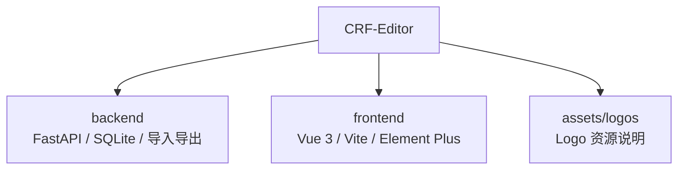

# CRF 编辑器 — 项目 AI 上下文

## 项目概览
- CRF（Case Report Form）编辑器用于临床研究表单的设计、维护、导入、预览与导出。
- 当前架构：FastAPI + Vue 3 前后端分离；桌面发行入口位于 `backend/app_launcher.py`。
- 面向用户的项目文档见：`README.md`、`README.en.md`。
- 详细模块说明见：`backend/.Codex/AGENTS.md`、`frontend/.Codex/AGENTS.md`。

## 模块导航


## 核心能力
- 项目、访视、表单、字段、单位、选项字典管理
- 用户认证、管理员用户管理与项目隔离
- 模板库 `.db` 导入、项目 `.db` 导入/整库合并、Word `.docx` 导入对比
- 表单设计器实时预览、字段实例快编、CRF 模拟渲染
- 项目复制、项目 Logo 管理、Word/数据库导出
- AI 配置测试、主题切换与桌面打包发行

## 关键入口
- 后端开发入口：`backend/main.py`
- 桌面发行入口：`backend/app_launcher.py`
- 后端配置：`backend/src/config.py`（读取项目根目录 `config.yaml`）
- 后端数据库：`backend/src/database.py`（SQLite PRAGMA 与轻量迁移）
- 前端入口：`frontend/src/main.js`
- 前端应用壳层：`frontend/src/App.vue`
- 前端开发配置：`frontend/vite.config.js`

## 常用命令
```bash
cd backend && python main.py
cd frontend && npm run dev
cd frontend && npm run build
cd backend && python -m pytest
cd frontend && node --test tests/*.test.js
```

## 开发约定
- 后端分层：`routers -> repositories/services -> models/schemas`
- 重逻辑放 `services/`，接口层保持轻量
- 数据结构演进由 `backend/src/database.py` 内轻量迁移维护
- 前端复杂复用逻辑放 `composables/`
- API 请求统一走 `frontend/src/composables/useApi.js`
- 字段渲染统一复用 `frontend/src/composables/useCRFRenderer.js`

## 维护原则
- 根级 `AGENTS.md` 只保留全局关键上下文，细节下沉到模块级文档。
- 功能、命令或测试入口变更时，同步更新 `README.md`、`README.en.md` 与模块级 `AGENTS.md`。
- 更新文档时优先保持简洁、准确、可导航。
<!-- TRELLIS:START -->
# Trellis Instructions

These instructions are for AI assistants working in this project.

Use the `/trellis:start` command when starting a new session to:
- Initialize your developer identity
- Understand current project context
- Read relevant guidelines

Use `@/.trellis/` to learn:
- Development workflow (`workflow.md`)
- Project structure guidelines (`spec/`)
- Developer workspace (`workspace/`)

If you're using Codex, project-scoped helpers may also live in:
- `.agents/skills/` for reusable Trellis skills
- `.codex/agents/` for optional custom subagents

Keep this managed block so 'trellis update' can refresh the instructions.

<!-- TRELLIS:END -->
